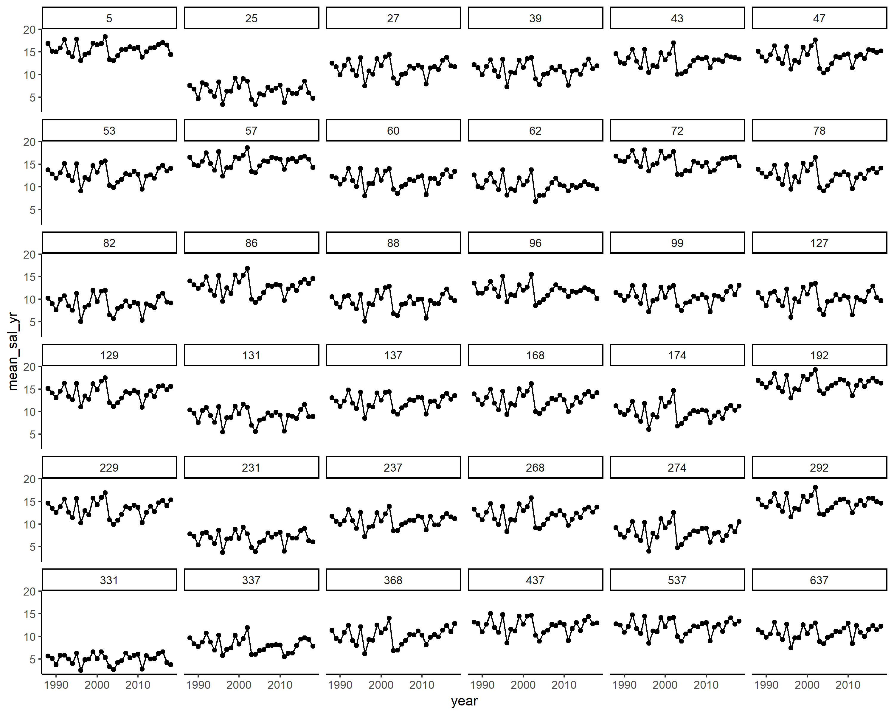

Salinity at Oyster Bars
================

Organizaion
-----------

-   **code** contains scripts and functions used for analysis
-   **data** contains the data the code reads in
-   **derived\_data** are data produced by running the code
-   **figures** are figures by running the code

Output of interest
------------------

See `./derived_data/3_calc_sal_by_NOAA_code/avg_sal_NOAA_yr.csv` for predictions of salinity by NOAA code and year. Also plotted in figures:

